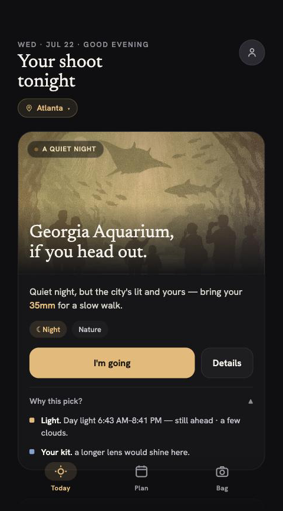
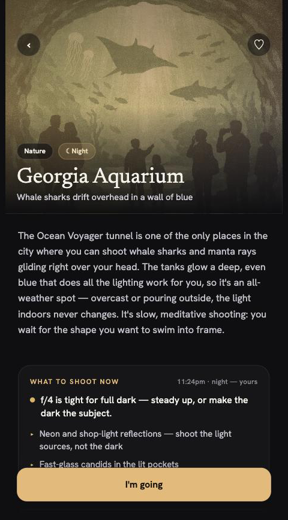
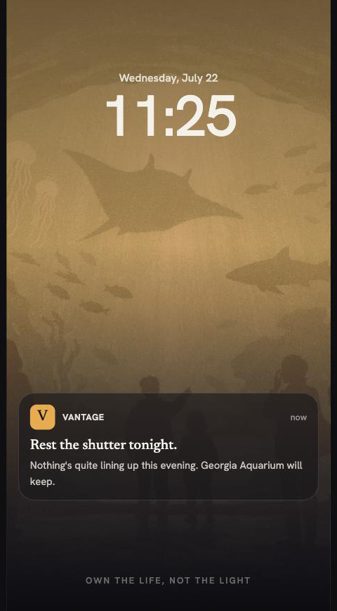

# Vantage

**A mobile app that gives a photographer a personal reason to shoot _today_ — the right place, the right light, matched to the gear in their bag.** An inspiration engine, not a maps utility.

Every evening it reads the sky, the sun, and your kit — and _only when they line up_ — buzzes your phone: here's where to be tonight, and why. No feed to scroll, no daily nag. The goal is to inspire a dormant shooter back out the door, not to add another notification.

| Today — tonight's pick | Spot detail — what to shoot now | The nudge |
|:--:|:--:|:--:|
|  |  |  |

---

## Highlights

- **A nightly nudge that earns the interruption.** A scoring engine weighs tonight's light timing against the genres your gear actually shoots, and only pushes when the night clears a quality bar — inspire, don't spam. Live end-to-end: Supabase cron → the scoring "brain" → Expo Push → your phone.
- **Genre-honest, weather-aware light scoring.** "Golden hour" is a landscape bias — street photography is light-flexible, landscape lives and dies by it. So light quality is scored _per genre_, and real cloud cover (Open-Meteo) tempers it: an overcast evening steers you to flat-light street instead of a washed-out golden vista. The weighting is grounded in a 22-source research pass, not vibes.
- **Phase-honest surfaces.** The app never tells you "golden hour hits 8:05" at 9:30pm — every surface reads the light you have _now_, with a forward look to what's next.
- **An LLM content pipeline.** Curate candidate spots from OpenStreetMap → human vet → draft copy with Claude (structured output, house voice baked in) → generate cohesive illustrations → serve from Postgres. Two cities, ~30 spots, for a couple of dollars.
- **Honest by principle.** No invented data — no fake "last entry 9 PM," no stock photos standing in for real places, no faked GPS distances. If the app doesn't know, it doesn't say.

## How it works

```
 Expo / React Native app  ──anon auth + gear sync──▶  Supabase (Postgres + RLS)
        ▲                                                     │
        │                                          pg_cron, nightly ~6pm
   Expo Push  ◀──── the "nudge brain" (Deno Edge Function) ◀──┘
                    scores light × gear, writes tonight's pick
```

The scoring brain is a pure, unit-tested function that runs in **two places** — on-device (TypeScript) for the live app, and server-side (Deno) for the nightly push — kept in agreement so the notification always matches what the app would show.

**Stack:** React Native (Expo SDK 57) · TypeScript · Supabase (Postgres, Edge Functions, `pg_cron`) · Expo Push / Firebase FCM · Open-Meteo (weather) · SunCalc (light math) · Claude (content) + GPT Image 1.5 (illustrations).

## A few problems worth a closer look

Each links a short architecture-decision write-up:

- **[Why light quality is genre-dependent](docs/engineering/LIGHT_QUALITY_GENRE.html)** — replacing a global "golden > flat" weight with per-genre light sensitivity, grounded in [research](docs/engineering/LIGHT_GENRE_RESEARCH.md).
- **[Keeping the app and the push in agreement](docs/engineering/PUSH_ARCHITECTURE.html)** — the same scoring logic living on a phone and in a serverless function without drifting.
- **[Stop headlining the same spot every day](docs/engineering/HERO_ANTI_REPEAT.md)** — an anti-repeat rule that rotates the daily pick while staying stable _within_ a day.

## Status

Personal project, actively built. The core loop is **live end-to-end**: an Android build runs on a real device and the nightly push has been verified firing on its own. **148 unit tests** cover the scoring, gear, light, and weather logic. iOS is pending an Apple Developer account; everything else was built at $0 infra.

## Go deeper

- **[PROJECT_MAP.md](PROJECT_MAP.md)** — the full working map: folder guide, doc index, and detailed status.
- **[The product thinking](docs/strategy/PRODUCT_BRIEF.html)** and **[the market gap](docs/strategy/COMPETITIVE_LANDSCAPE.html)** — who this serves and the open quadrant it aims at.
- **[BACKLOG.md](docs/BACKLOG.md)** — what's shipped and what's next.

---

<sub>Screens captured from the running app. A short screen-recording of a nudge → Today would be a strong addition if you want to grab one.</sub>
